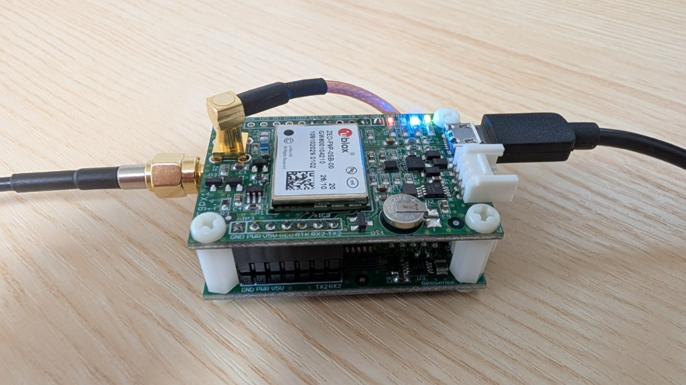

# Takion CLAS / RTK Web Monitor

高精度測位モジュール「[TakionCM001](https://store.shopping.yahoo.co.jp/tamaki-syouji/takion2022-001.html)」専用の、ブラウザ完結型高精度測位モニターアプリケーションです。



Google Chrome などの **Web Serial API** 対応ブラウザから直接USBシリアルポートを開き、測位状況（CLAS / ネットワークRTK / 単独測位）や NMEA / UBX / RTCM 電文の解析ログをリアルタイムに表示します。

---

## 主な機能

1. **Web Serial 接続**
   - ブラウザから直接 TakionCM001 に接続。
   - ボーレート変更（9600 〜 460800 bps）対応。
   - NAV-PVT メッセージの有効化/無効化制御。

2. **2つの補正測位モード対応**
   - **CLAS モード (みちびき L6 衛星補正)**: 準天頂衛星「みちびき」からのセンチメートル級補正情報を利用。
   - **ネットワークRTK (NTRIP) モード**: NTRIP Caster (rtk2go.com, 各種キャスター等) から補正データ (RTCM) を取得し、受信機へ注入してRTK測位を実現。

3. **リアルタイムマップ & 衛星集計**
   - MapLibre GL を使用した現在地と推定水平誤差（誤差円）のリアルタイム表示。進行方向に合わせてマーカーが回転し、測位品質で色が変わります。
   - GPS, QZSS (みちびき), GLONASS, Galileo, BeiDou, SBAS 別の使用衛星数・可視衛星数と、HDOP / PDOP / VDOP の表示。
   - 「全画面」で地図をブラウザいっぱいに広げられます（`Esc` または「全画面を解除」で戻ります）。測位品質・推定誤差・速度・進行方向と軌跡の記録操作は上部の帯に残るため、移動しながら地図を大きく見たいときはこのまま記録を続けられます。

4. **移動軌跡の記録とダウンロード**
   - 「記録開始」から地図上に移動の軌跡をリアルタイム描画。Fix / Float / 単独測位を色で塗り分け、測位が途切れた区間は線を繋ぎません。
   - 「軌跡を隠す」で、記録を続けたまま地図の表示だけを消せます（現在地の確認に集中したいとき用）。
   - 時刻・緯度・経度に加え、標高・測位品質・使用衛星数・HDOP・推定誤差までを記録し、**CSV / GPX / GeoJSON** で書き出せます。
   - 記録中の軌跡はブラウザの IndexedDB へ逐次保存されるため、誤ってタブを閉じても次回開いたときに復元できます。

5. **電文ログビューア & リファレンス**
   - 受信した NMEA / UBX / RTCM 電文をリアルタイム解析して日本語で解説表示。
   - 電文辞書（リファレンスモーダル）による各プロトコルの詳細情報検索。

---

## ローカルでの起動手順

### 必要環境
- **ハードウェア**: [TakionCM001](https://store.shopping.yahoo.co.jp/tamaki-syouji/takion2022-001.html) 本体、対応アンテナ、USBケーブル
- **ソフトウェア**: Node.js 22+ (テスト実行には Node 22.15+ が必要です)
- **ブラウザ**: Google Chrome, Microsoft Edge 等の Web Serial API 対応ブラウザ

### 1. リポジトリのクローン
```bash
git clone https://github.com/futomi/takion-clas-rtk-web-monitor.git
cd takion-clas-rtk-web-monitor
```

### 2. 依存パッケージのインストール
```bash
npm install
```

### 3. アプリの起動
```bash
npm run dev
```

### 4. TakionCM001 の接続と利用
1. TakionCM001 にアンテナを接続し、USB ケーブルで PC に接続します。
2. ブラウザで [http://localhost:3000](http://localhost:3000) を開きます。
3. 画面左上の「接続」ボタンをクリックします。
4. ブラウザのポート選択ダイアログが表示されるので、TakionCM001 のデバイス（例: `u-blox GNSS receiver` や `USB シリアル デバイス` 等）を選択して「接続」をクリックすると、リアルタイムモニターが開始されます。


## 開発

### プロジェクト構成

```
app/
  lib/          プロトコル解析・集計・整形のロジック（React 非依存の純粋関数）
    nmea.ts         NMEA 0183 センテンスの解析
    ubx.ts          UBX バイナリの解析と設定コマンド
    rtcm.ts         RTCM3 フレームの解析と CRC-24Q
    frameScanner.ts 混在バイト列からのフレーム切り出し
    satelliteTracker.ts   GSV / GSA から衛星を集計
    correctionSource.ts   補正ソースと測位品質の表示判定
    ntrip.ts              Source-table の解析と配信局の並べ替え
    ntripHeader.ts        Caster 応答ヘッダの解析とリクエスト組み立て
    messageDictionary.ts  電文解説の辞書
    track.ts              軌跡の間引き判定・距離集計・地図用 GeoJSON の組み立て
    trackExport.ts        軌跡の CSV / GPX / GeoJSON への書き出し
    trackStore.ts         記録中の軌跡の IndexedDB への保存と復元
    server/               サーバー専用（接続先ホストの検証・呼び出し元オリジンの検証・
                          リクエストボディの上限付き読み取り・Caster への接続と中継・同時実行数の制限）
  hooks/        Web Serial 受信・NTRIP 接続・軌跡記録・地図の全画面・ログ追従の状態管理
  components/   表示コンポーネント
  styles/       画面領域ごとのスタイルシート（読み込み順の目次は app/globals.css）
    base.css        リセットと Fluent 2 のデザイントークン
  api/ntrip/    NTRIP Caster への中継 API
tests/          app/lib 配下に対する単体テスト
```

`app/lib` 配下は DOM にも React にも依存しないため、そのまま単体テストできます。

画面のデザインは Microsoft の [Fluent 2 Design System](https://fluent2.microsoft.design/) に沿っています。
型ランプ・配色・角丸・余白・エレベーション・モーション・フォーカス表示は
すべて `app/styles/base.css` のトークンとして定義してあり、
他のスタイルシートは値を持たずにそれを参照します。配色は Fluent 2 のニュートラル ramp と、
アプリの識別色である緑を Fluent と同じ 16 段構成へ組み直したブランド ramp の 2 系統です。

### コマンド

```bash
npm run dev        # 開発サーバー
npm run build      # 本番ビルド
npm run lint       # ESLint
npm run typecheck  # 型チェック（アプリ・テストの両方）
npm test           # 単体テスト
npm run check      # lint + typecheck + test をまとめて実行
```

テストは Node.js 組み込みのテストランナーで動作し、追加の依存パッケージを必要としません。

### 環境変数

| 変数名 | 既定値 | 用途 |
| --- | --- | --- |
| `SITE_ORIGIN` | `http://localhost:3000` | OGP 画像などの絶対 URL を組み立てる基準オリジン。公開時は実際の URL を指定します |
| `NTRIP_ALLOWED_HOSTS` | （未設定＝プライベート宛でなければ許可） | NTRIP Caster として接続を許可するホストのカンマ区切り一覧 |
| `NTRIP_MAX_CONCURRENT_STREAMS` | `4` | NTRIP ストリーム中継の同時接続数の上限 |
| `NTRIP_MAX_CONCURRENT_SOURCETABLES` | `4` | 配信局一覧（Source-table）取得の同時実行数の上限 |
| `NTRIP_SOURCETABLE_CACHE_SECONDS` | `600` | 配信局一覧を控えておく長さ（秒）。`0` でキャッシュを無効化します |

### 接続先ホストの制限

`/api/ntrip/*` はブラウザから指定されたホストへサーバー側から TCP 接続します。
そのままではプライベートネットワークへの到達（SSRF）を許してしまうため、名前解決の結果を
検査し、ループバック・プライベート・リンクローカル宛の接続を拒否しています。

公開環境では、環境変数 `NTRIP_ALLOWED_HOSTS` に接続を許可するホストをカンマ区切りで
指定することで、さらに接続先を限定できます。

```bash
NTRIP_ALLOWED_HOSTS=rtk2go.com,ntrip.example.jp npm run start
```

なお、マウントポイント名とホスト名は組み立てた HTTP リクエストへそのまま載るため、
制御文字や空白を含む値は組み立て時点で拒否しています（リクエストスプリッティング対策）。
マウントポイント名・認証情報・リクエストボディにはそれぞれ長さの上限を設けており、
巨大な値を送りつけてサーバーから第三者へ大量のデータを送らせること（増幅）も防いでいます。

### 越境呼び出しの拒否

`/api/ntrip/*` は認証を要求しないため、外部サイトが訪問者のブラウザを経由して
呼び出せてしまうと、そのまま踏み台になります。`Sec-Fetch-Site` と `Origin` を検査し、
このアプリ自身のページ以外からの呼び出しは 403 で拒否しています。

（ブラウザ以外のクライアントはこれらのヘッダを詐称できるため、この検査だけに頼らず、
下記の同時実行数の制限と上記の接続先の制限を併せて働かせています。）

`Origin` の照合には受け取った `Host` ヘッダを使います。リバースプロキシを前段に置く場合は、
**`Host` をブラウザが送った値のまま透過させてください**（`X-Forwarded-Host` へ退避させて
`Host` を内部名へ書き換える設定だと、正当な呼び出しまで 403 になります）。
nginx なら `proxy_set_header Host $host;` が該当します。

### 同時実行数の制限

`/api/ntrip/*` はいずれも 1 リクエストにつき Caster への TCP 接続を 1 本開きます。
ストリーム中継は長時間張り続け、配信局一覧の取得は最大 4 MB を受信します。
無制限に受け付けるとプロセスのソケットとメモリを食い潰されるため、プロセスあたりの
同時本数を既定でそれぞれ 4 本に制限しています。上限は環境変数で変更できます。

```bash
NTRIP_MAX_CONCURRENT_STREAMS=8 NTRIP_MAX_CONCURRENT_SOURCETABLES=8 npm run start
```

また、ストリーム中継は受け取り側が読み出しに追いつかない場合、Caster 側の受信を
一時停止して背圧をかけます。遅いクライアント 1 つでメモリを圧迫させないためです。

これはあくまで最後の歯止めです。インターネットへ公開する場合は、リバースプロキシなど
前段でのレート制限とアクセス制限を併せて設けてください。

### 配信局一覧のキャッシュ

配信局の一覧は、そこそこの大きさがある割に中身がほとんど変わりません（rtk2go の実測で
694 局・生データ 109 KB）。そこで取得済みの応答をプロセス内に一定時間（既定 10 分）だけ控え、
その間の再取得は Caster へ行かずに返します。

控えが切れた直後に依頼が重なった場合は、Caster への取得を 1 本にまとめて相乗りさせます。
期限切れのたびに人数ぶんの取得が飛ぶのを防ぐためです。

```bash
NTRIP_SOURCETABLE_CACHE_SECONDS=1800 npm run start   # 30 分に伸ばす
NTRIP_SOURCETABLE_CACHE_SECONDS=0 npm run start      # 無効化する
```

控える宛先は 4 件までで、上限に達すると古い宛先から落とします。1 件の大きさは Caster 次第で、
受信を打ち切る上限（4 MB）ぶんまで膨らみ得るためです。応答の `X-Sourcetable-Cache` ヘッダに
`hit` / `miss` が入るので、効いているかはここで確かめられます。

なお公開環境では、利用者ぶんの取得がすべてサーバー 1 台の IP から出ていきます。
rtk2go は過大なアクセスを繰り返す IP をブロックする方針を明示しているため、
キャッシュを無効化したまま公開するのは避けてください。

### 軌跡ログの保存先

記録中の軌跡はブラウザの IndexedDB（データベース名 `takion_track`）へ 2 秒ごとにまとめて
書き出しています。1 点ずつ書くと 1 秒に何度も書き込みが走るためで、代わりに直近 2 秒ぶんは
突然の終了で失われます。同時に扱う軌跡は 1 本だけで、記録を開始すると前回の軌跡は破棄されます。

記録中のまま閉じられた軌跡は、次に開いたときに復元して知らせますが、**自動では再開しません**。
押していない操作が勝手に始まると、意図しない区間まで 1 本の軌跡として繋がってしまうためです。

保持できるのは 50,000 点（1 秒間隔でおよそ 13.8 時間）までです。上限に達したら古い点を捨てるのではなく
記録のほうを止めます。欠けたログを完全なものとしてダウンロードさせないためです。

なお、プライベートモードなどで IndexedDB が使えない場合も記録自体は続きますが、
その旨を画面に表示したうえでメモリ上のみの保持となり、リロードすると失われます。

書き出した CSV は Excel での文字化けを避けるため、UTF-8 BOM 付き・CRLF 改行にしています。

### NTRIP のパスワードの扱い

NTRIP の接続設定（Caster、ポート、マウントポイント、ユーザー名）はブラウザの
localStorage に保存されますが、**パスワードは保存されません**。localStorage は同一
オリジンの任意のスクリプトから平文で読み出せるため、認証情報の保存先として適さないためです。
また、認証情報は API へ POST のボディで送信し、URL に含めないようにしています。


## ライセンス

このリポジトリのソースコードは [MIT License](LICENSE) で公開しています。

なお、依存パッケージ（Next.js、React、MapLibre GL JS など）はそれぞれ独自のライセンスに従います。
`docs/images/` の製品写真は TakionCM001 の紹介用素材であり、MIT License の対象には含みません。
